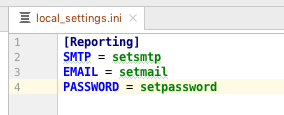
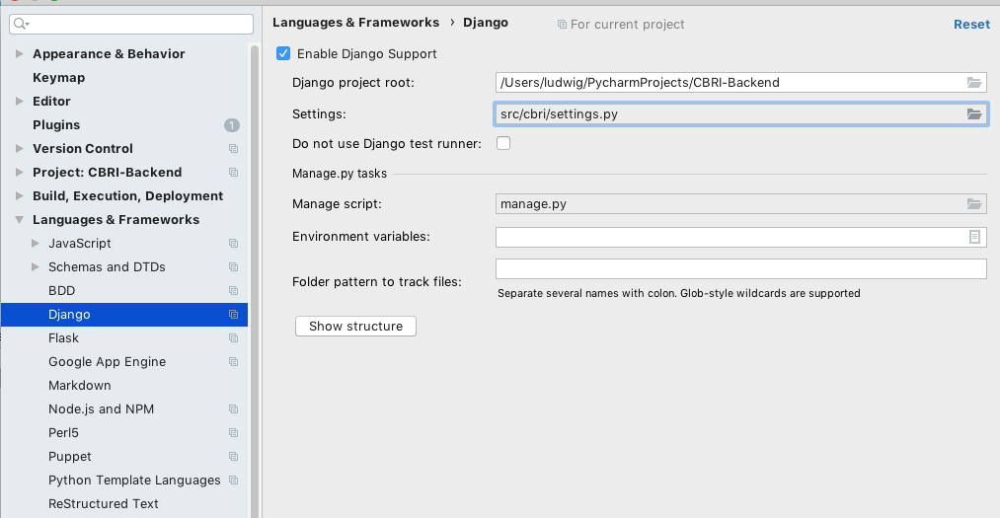
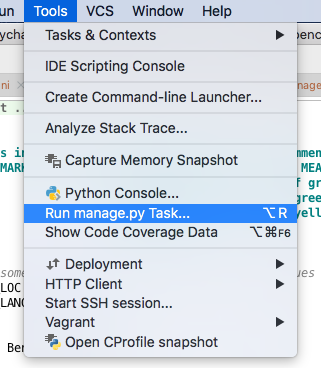

# CBRI-Backend
CBR Insight: Measure Source Code Quality

## Prerequisites

1. Install a licensed copy of Understand from [SciTools](https://scitools.com/).

2. Setup CBRI_UND and CBRI_UPERL environment variables that point 
to the location of the Understand 'und' and 'uperl' tools. 
For example, on a mac this would involve adding these to lines to 
.bash_profile:
`export CBRI_UPERL=/Applications/Understand.app/Contents/MacOS/uperl
export CBRI_UND=/Applications/Understand.app/Contents/MacOS/und`

3. Install Python 3.

4. Install the PyCharm IDE (optional, but helpful)

## Checkout and Configuration

1. Checkout CBRI-Backend from GitHub into a new PyCharm project.

2. Use PyCharm to setup a Python 3 virtual environment and 
install all packages in requirements.txt.

3. Create a mail server account for CBRI (e.g. on your mail server or using Gmail) and change settings in 
local_settings.ini.

4. Turn on Django support in PyCharm.

5. Create a launch configuration in PyCharm.

## Development Server 

1. Run the CBRI-Backend configuration to start the server.

2. Run manage.py (first image) and then run `process_tasks` 
(second image) to start the task manager that performs the 
long-running analysis jobs.

